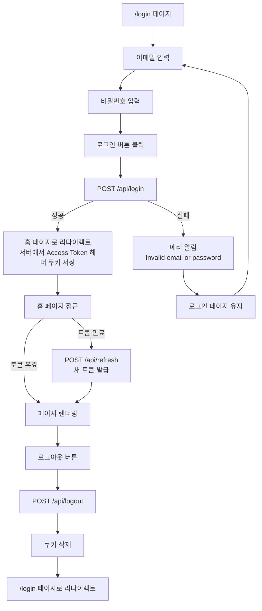
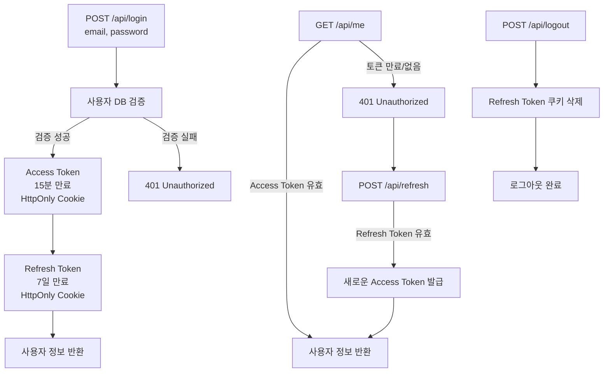

# Auth Test - JWT 인증 플로우

간단한 JWT 기반 인증 시스템 플로우입니다. Access Token과 Refresh Token을 이용한 보안 인증 구현입니다.

## 📊 인증 플로우

### 🔵 프론트엔드 플로우 (UI)



### 🔴 백엔드 플로우 (API)



## 🔑 토큰 정책

| 토큰          | 만료 시간 | 저장 위치       | 용도      |
| ------------- | --------- | --------------- | --------- |
| Access Token  | 15분      | HttpOnly Cookie | API 인증  |
| Refresh Token | 7일       | HttpOnly Cookie | 토큰 갱신 |

## 🔐 보안 설정

- **HttpOnly**: JavaScript 접근 불가 (XSS 방지)
- **Secure**: HTTPS 환경에서만 전송 (개발 환경 제외)
- **SameSite: strict**: CSRF 공격 방지

## 📡 API 명세

### 1. 로그인 `POST /api/login`

```bash
curl -X POST http://localhost:3000/api/login \
  -H "Content-Type: application/json" \
  -d '{"email":"test@test.com","password":"password123"}'
```

**요청:**

```json
{
  "email": "test@test.com",
  "password": "password123"
}
```

**응답 (성공 200):**

```json
{
  "message": "Login successful",
  "user": {
    "id": "user-1",
    "email": "test@test.com",
    "name": "Test User"
  }
}
```

---

### 2. 사용자 정보 조회 `GET /api/me`

```bash
curl http://localhost:3000/api/me
```

**응답 (성공 200):**

```json
{
  "message": "User information",
  "user": {
    "id": "user-1",
    "email": "test@test.com",
    "name": "Test User"
  }
}
```

**응답 (실패 401):**

```json
{
  "error": "Invalid or expired access token"
}
```

---

### 3. 토큰 갱신 `POST /api/refresh`

```bash
curl -X POST http://localhost:3000/api/refresh
```

**응답 (성공 200):**

```json
{
  "message": "Access token refreshed",
  "user": {
    "id": "user-1",
    "email": "test@test.com",
    "name": "Test User"
  }
}
```

---

### 4. 로그아웃 `POST /api/logout`

```bash
curl -X POST http://localhost:3000/api/logout
```

**응답 (성공 200):**

```json
{
  "message": "Logout successful"
}
```

## 🧪 테스트 목록

### E2E 테스트 (Playwright)

**테스트 실행 환경:** Chromium, Firefox, WebKit (총 12개 테스트 × 3브라우저 = 36개 케이스)

**실행 방법:**

```bash
# 모든 E2E 테스트 실행
pnpm test:e2e

# UI 모드로 테스트 실행 (대화형)
pnpm test:e2e --ui

# 특정 테스트 파일만 실행
pnpm test:e2e login.spec.ts
pnpm test:e2e logout.spec.ts
pnpm test:e2e protect.spec.ts
pnpm test:e2e token-refresh.spec.ts

# 특정 브라우저만 실행
pnpm test:e2e --project=chromium
pnpm test:e2e --project=firefox
pnpm test:e2e --project=webkit
```

---

#### 1️⃣ 로그인 플로우 테스트 (login.spec.ts)

- 성공적으로 로그인하고 홈 페이지로 리다이렉트되어야 함
- 잘못된 비밀번호로 로그인 실패

#### 2️⃣ 로그아웃 플로우 테스트 (logout.spec.ts)

- 로그인 후 로그아웃할 수 있어야 함
- 로그아웃 후 쿠키가 삭제되어야 함
- 로그아웃 후 /api/me 요청이 실패해야 함

#### 3️⃣ 인증 페이지 검증 테스트 (protect.spec.ts)

- 로그아웃 후 인증 페이지에 접근할 수 없어야 함
- 로그인 후 인증 페이지에 접근할 수 있어야 함

#### 4️⃣ 토큰 갱신 자동화 테스트 (token-refresh.spec.ts)

- AccessToken 만료 후 자동으로 갱신되어야 함
- RefreshToken 만료 시 로그인 페이지로 리다이렉트되어야 함
- 동시에 여러 요청이 401을 받을 때 refresh가 한 번만 실행되어야 함
- 로그인 후 접근 권한이 없는 리소스 요청 시 refresh 후 재시도하지 못하면 로그인 이동
- 여러 요청 동시 발생 시 race condition 테스트

## 🧪 테스트 계정

```
Email: test@test.com
Password: password123
```
