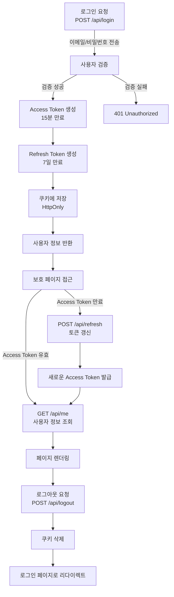

# Auth Test - JWT 인증 플로우

간단한 JWT 기반 인증 시스템 플로우입니다. Access Token과 Refresh Token을 이용한 보안 인증 구현입니다.

## 📊 인증 플로우



## 🔑 토큰 정책

| 토큰 | 만료 시간 | 저장 위치 | 용도 |
|------|---------|---------|------|
| Access Token | 15분 | HttpOnly Cookie | API 인증 |
| Refresh Token | 7일 | HttpOnly Cookie | 토큰 갱신 |

## 🔐 보안 설정

- **HttpOnly**: JavaScript 접근 불가 (XSS 방지)
- **Secure**: HTTPS 환경에서만 전송 (개발 환경 제외)
- **SameSite: strict**: CSRF 공격 방지

## 📡 API 명세

### 1. 로그인 `POST /api/login`

```bash
curl -X POST http://localhost:3000/api/login \
  -H "Content-Type: application/json" \
  -d '{"email":"test@test.com","password":"password123"}'
```

**요청:**
```json
{
  "email": "test@test.com",
  "password": "password123"
}
```

**응답 (성공 200):**
```json
{
  "message": "Login successful",
  "user": {
    "id": "user-1",
    "email": "test@test.com",
    "name": "Test User"
  }
}
```

---

### 2. 사용자 정보 조회 `GET /api/me`

```bash
curl http://localhost:3000/api/me
```

**응답 (성공 200):**
```json
{
  "message": "User information",
  "user": {
    "id": "user-1",
    "email": "test@test.com",
    "name": "Test User"
  }
}
```

**응답 (실패 401):**
```json
{
  "error": "Invalid or expired access token"
}
```

---

### 3. 토큰 갱신 `POST /api/refresh`

```bash
curl -X POST http://localhost:3000/api/refresh
```

**응답 (성공 200):**
```json
{
  "message": "Access token refreshed",
  "user": {
    "id": "user-1",
    "email": "test@test.com",
    "name": "Test User"
  }
}
```

---

### 4. 로그아웃 `POST /api/logout`

```bash
curl -X POST http://localhost:3000/api/logout
```

**응답 (성공 200):**
```json
{
  "message": "Logout successful"
}
```

## 🧪 테스트 계정

```
Email: test@test.com
Password: password123
```

## 🚀 시작하기

```bash
# 개발 서버 시작
npm run dev

# 로그인 테스트
curl -X POST http://localhost:3000/api/login \
  -H "Content-Type: application/json" \
  -d '{"email":"test@test.com","password":"password123"}'

# 사용자 정보 조회 (로그인 후)
curl http://localhost:3000/api/me

# 로그아웃
curl -X POST http://localhost:3000/api/logout
```

## 📁 파일 구조

```
src/
├── lib/
│   └── auth.ts              # 토큰 생성/검증 유틸
├── app/
│   ├── api/
│   │   ├── login/
│   │   │   └── route.ts     # 로그인 API
│   │   ├── me/
│   │   │   └── route.ts     # 사용자 정보 조회
│   │   ├── refresh/
│   │   │   └── route.ts     # 토큰 갱신 API
│   │   └── logout/
│   │       └── route.ts     # 로그아웃 API
│   └── ...
```
